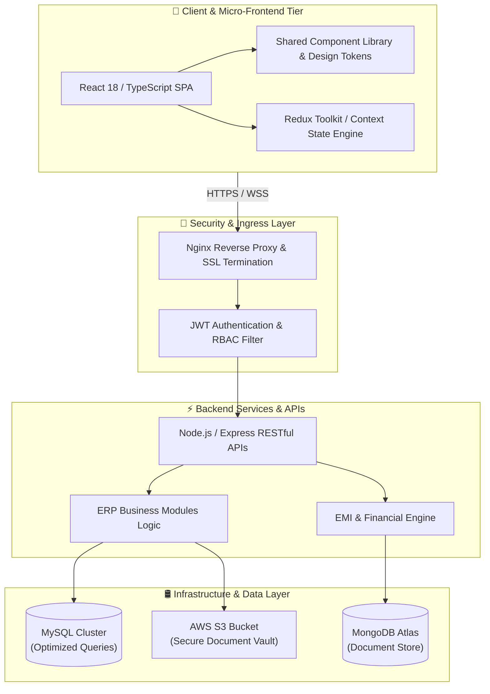

<div align="center">

<!-- Header Banner -->


<!-- Typing SVG Subtitle -->
<a href="https://git.io/typing-svg">
  
</a>

<br/><br/>

<!-- Quick Link Badges -->
<a href="http://sagardev.work.gd/"></a>
<a href="https://linkedin.com/in/sagar-kumar-rana6664/"></a>
<a href="https://github.com/s1g1rkumar"></a>
<a href="mailto:sagar.rana.dev@gmail.com"></a>

</div>

<br/>

---

### ⚡ Executive Overview & Architecture Matrix

```typescript
interface StaffSoftwareEngineer {
  name: "Sagar Kumar Rana";
  title: "Senior Full-Stack & Enterprise Systems Architect";
  experience: "4+ Years Enterprise Engineering & System Design";
  domainExpertise: [
    "Multi-Tenant Enterprise ERPs",
    "Real-time FinTech & EMI Management",
    "High-Throughput Micro-Frontends",
    "Distributed Cloud Architectures (AWS & Docker)"
  ];
  provenImpact: {
    activeScale: "50,000+ End Users Across 11+ Client Organizations",
    platformUptime: "99.5% SLA in Production Environments",
    performanceGain: "10% - 35% Faster Dashboard & Transaction Endpoint Speeds",
    devVelocity: "20% - 35% Reduction in Feature Delivery Time"
  };
  engineeringPhilosophy: "Build resilient, self-healing systems. Decouple early, measure everything, and deliver software that thrives at scale.";
}
```

<br/>

### 🎯 Key Performance & Scale Metrics

| 🚀 Metric | 📊 Scale / Achievement | 🛠️ Strategic Impact |
| :--- | :--- | :--- |
| **User Ecosystem** | **50,000+ Active Users** | Multi-tenant security & multi-org isolation |
| **Enterprise Modules** | **8 Full ERP Subsystems** | Sales, HR, Finance, Inventory, Quotation, Invoicing, Attendance, Analytics |
| **System Uptime** | **99.5% Reliability SLA** | High-availability backend APIs running on AWS EC2 & S3 |
| **Deployment Efficiency** | **60-Min CI/CD Automation** | Cut release cycles from hours to minutes using GitHub Actions & Docker |
| **API Throughput** | **30+ RESTful Services** | Optimized SQL queries & caching reducing endpoint latency by 20-40% |

<br/>

---

### 🏗️ High-Level System Architecture Design



<br/>

---

### 🛠️ Technical Capabilities & Stack Matrix

<div align="center">

| Core Category | Technologies & Tools |
| :--- | :--- |
| **Languages & Core** |     |
| **Frontend Architecture** |      |
| **Backend & Microservices** |      |
| **Databases & Caching** |     |
| **Cloud & DevOps** |      |
| **Tooling & Practices** |      |

<br/>


</div>

<br/>

---

### 💼 Career Architecture & Proven Achievements

<details open>
<summary><b>🔹 Senior Frontend Developer — Clapcle Infotech Pvt. Ltd.</b> <i>(Dec 2025 – Present · Onsite)</i></summary>
<br/>

> **Core Objective:** Lead frontend engineering for multi-tenant enterprise ERP solutions serving **11+ corporate organizations** and **50,000+ active users**.

- 🏢 **Architected 8 Core Enterprise ERP Modules:** Sales, Inventory, Purchase, Quotation, Invoicing, HR, Attendance, and Executive Analytics dashboards using React 18, TypeScript, and Redux Toolkit.
- 🎨 **Shared Component Library:** Built an enterprise design system & reusable component suite, slashing new feature development cycles by **20–35%**.
- ⚡ **Performance Engineering:** Implemented dynamic route lazy-loading, selective memoization (`React.memo`), and intelligent bundle splitting, achieving **10–15% lower initial load times** on heavy analytical dashboards.
- 🔐 **Multi-Tenant Security & Access:** Integrated JWT authentication with granular Role-Based Access Control (RBAC) to isolate enterprise multi-tenant workflows securely.
- 🐳 **Cloud & Microservices Synergy:** Collaborated on 30+ RESTful APIs, containerizing modules with **Docker** for standardized deployment across **AWS** environments.

```text
Technologies: React.js · TypeScript · Redux Toolkit · Custom CSS · REST APIs · Docker · AWS · GitHub Actions
```
</details>

<details open>
<summary><b>🔹 Senior Software Developer — Renew J Software Solution Pvt. Ltd.</b> <i>(Sept 2024 – Nov 2025 · Remote)</i></summary>
<br/>

> **Core Objective:** Design and deliver an end-to-end EMI & Financial Loan Management Platform maintaining **99.5% platform uptime SLA**.

- 📈 **High-Availability Financial Platform:** Built real-time loan origination, EMI schedule tracking, and transaction processing engines backed by React, TypeScript, Node.js, and MySQL.
- ⚙️ **Automated CI/CD Pipeline:** Established GitHub Actions CI/CD workflows and Dockerized container deployments, reducing release windows from **hours down to 30–60 minutes**.
- 🗃️ **Database & Endpoint Optimization:** Refactored backend business logic and complex SQL joins, accelerating core transaction API response rates by **20–40%**.
- 🎯 **UX Optimization:** Redesigned loan disbursement & payment workflows, delivering a **10–20% increase in user task completion efficiency**.

```text
Technologies: React.js · TypeScript · Node.js · Express.js · MySQL · AWS (EC2, S3) · Docker · CI/CD
```
</details>

<details open>
<summary><b>🔹 Software Developer — Invictus DigiSoft Pvt. Ltd.</b> <i>(Sept 2024 – Nov 2025 · Onsite)</i></summary>
<br/>

> **Core Objective:** Full-Stack development across MEAN/MERN stack applications supporting **5,000–10,000 end users**.

- 🖨️ **SP Media ERP:** Engineered a printing-press ERP (Quotations, Invoicing, Inventory, Sales) that accelerated order processing speeds by **10–25%**.
- 🎓 **Easy Tutor Platform:** Launched a SaaS learning & institute administration suite deployed across **15+ institutes and 1,000+ active students**.
- 📉 **Stock Market Course Platform:** Built high-performance responsive UI components for financial video streaming & course consumption, boosting page render speed by **30–40%**.
- ☁️ **Cloud Document Vault:** Integrated AWS S3 SDK for secure file upload and encrypted storage.

```text
Technologies: React.js · Angular · Node.js · Express.js · MongoDB · AWS S3 · MySQL
```
</details>

<br/>

---

### 🚀 Featured Enterprise Projects

<table>
  <tr>
    <td width="33%" valign="top">
      <h3 align="center">🏢 Enterprise ERP System</h3>
      <p align="center">
        <a href="https://erp.clapcle.com/"><b>Live Platform ↗</b></a>
      </p>
      <p>Multi-tenant enterprise suite powering <b>50,000+ users</b> across 11+ client organizations. Complete RBAC, automated invoicing, and real-time inventory management.</p>
      <p><b>Tech Stack:</b> React · TypeScript · Redux Toolkit · REST APIs · Docker · AWS</p>
    </td>
    <td width="33%" valign="top">
      <h3 align="center">🖨️ SP Media ERP</h3>
      <p align="center">
        <a href="https://app.spmedia.in/"><b>Live Platform ↗</b></a>
      </p>
      <p>Printing-press lifecycle management platform covering quotations, purchase orders, inventory, and AWS S3 document vault. Improved processing by <b>10–25%</b>.</p>
      <p><b>Tech Stack:</b> React · Node.js · Express · MySQL · AWS S3</p>
    </td>
    <td width="33%" valign="top">
      <h3 align="center">📚 Rajendra Suryawanshi Platform</h3>
      <p align="center">
        <a href="https://rajendravsuryawanshi.com/"><b>Live Platform ↗</b></a>
      </p>
      <p>Stock-market education portal featuring dynamic API integration and high-speed page rendering engine (<b>30–45% faster</b> throughput).</p>
      <p><b>Tech Stack:</b> React · JavaScript · Custom CSS · WebSockets</p>
    </td>
  </tr>
</table>

<br/>

---

### 📈 GitHub Engineering Analytics

<div align="center">

<table border="0">
  <tr>
    <td>
      
    </td>
    <td>
      
    </td>
  </tr>
</table>

<br/>


</div>

<br/>

---

### 🎓 Academic Credentials

```yaml
Degree: Master of Computer Applications (M.C.A.)
Institution: Jharkhand Rai University, Ranchi
Graduation Period: August 2019 – September 2021
Academic Distinction: CGPA 8.25 / 10.0
```

<br/>

---

### 📫 Connect & Collaborate

<div align="center">

Looking to discuss **Enterprise Architecture**, **Micro-Frontends**, **SaaS Scaling**, or **Senior Engineering Opportunities**?

<br/>

<a href="mailto:sagar.rana.dev@gmail.com"></a>
<a href="https://linkedin.com/in/sagar-kumar-rana6664/"></a>
<a href="http://sagardev.work.gd/"></a>
<a href="https://github.com/s1g1rkumar"></a>

<br/><br/>


</div>
